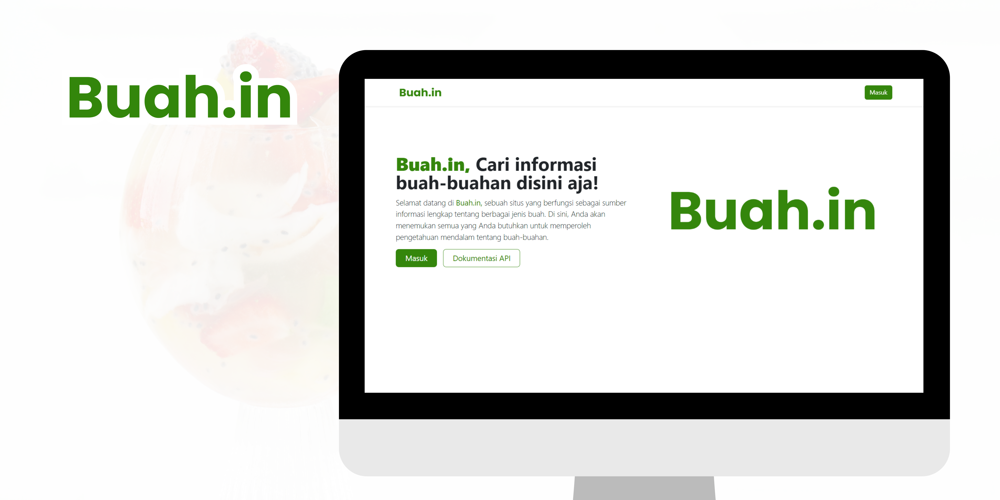

##

### Buah.in, Fruit Information Application

## 📙 Description

This is one of my assignments in the Multiplatform Programming course, this assignment involves creating a Web-based application that contains CRUD (Create, Read, Update, Delete) & Authentication (Login, Register, Logout, Remember me) and Mobile operations that will display data from the web application via the REST API. My group friends and I developed this web application using the PHP programming language, without using a framework such as CodeIgniter (CI) or Laravel.

